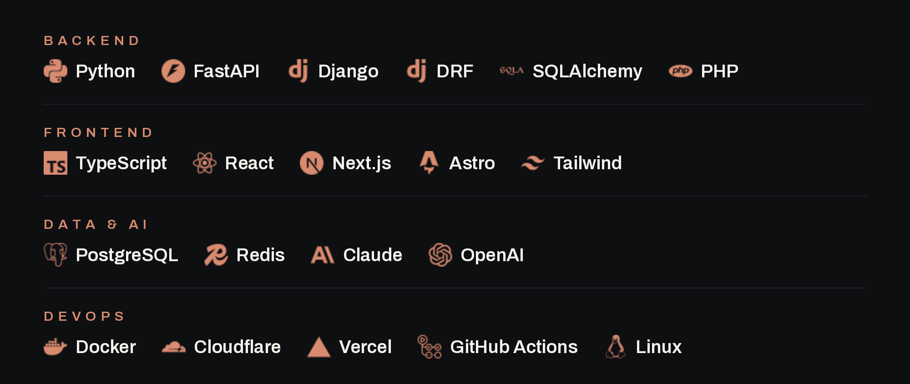

  

  

  
  &nbsp;
  
  &nbsp;
  

 

Full-stack engineer in Gdansk. I design, build and ship production web apps and AI-powered tools - end to end.

---

### What I do

<table>
  <tr>
    <td width="33%" align="center"><b>Backend &amp; AI</b> REST APIs, async services, auth, databases and AI pipelines - built to run in production.</td>
    <td width="33%" align="center"><b>Frontend</b> Fast, responsive interfaces - from design handoff to a shipped product.</td>
    <td width="33%" align="center"><b>Performance &amp; SEO</b> Lighthouse-grade speed and search optimisation that shows up in real metrics.</td>
  </tr>
</table>

---

### Stack

  

Also: C# / Unity (multiplayer) · Telegram &amp; Discord bots · Electron · Bun · Figma

---

### GitHub

  
  

  

  

· · ·

