  

  
  &nbsp;
  
  &nbsp;
  
  &nbsp;
  
  &nbsp;
  
  &nbsp;
  

---

## What I do

<table>
  <tr>
    <td width="33%" align="center"><b>⚙️ Backend</b> REST APIs, business logic, databases and auth - built to run in production.</td>
    <td width="33%" align="center"><b>🎨 Frontend</b> Responsive, fast interfaces - from design handoff to a working product.</td>
    <td width="33%" align="center"><b>📈 SEO</b> Performance and search optimisation that shows up in real metrics.</td>
  </tr>
</table>

---

## Tech stack

**Backend**

  
  
  
  
  
  
  
  

**Frontend**

  
  
  
  
  
  
  

**Tools & Workflow**

  
  
  
  

---

## Connect

  
  &nbsp;
  
  &nbsp;
  

---

## GitHub stats

  

  
  

  

  

  <picture>
    <source media="(prefers-color-scheme: dark)" srcset="https://raw.githubusercontent.com/jareksav/jareksav/output/github-contribution-grid-snake-dark.svg" />
    <source media="(prefers-color-scheme: light)" srcset="https://raw.githubusercontent.com/jareksav/jareksav/output/github-contribution-grid-snake.svg" />
    
  </picture>

## Detailed metrics

  

